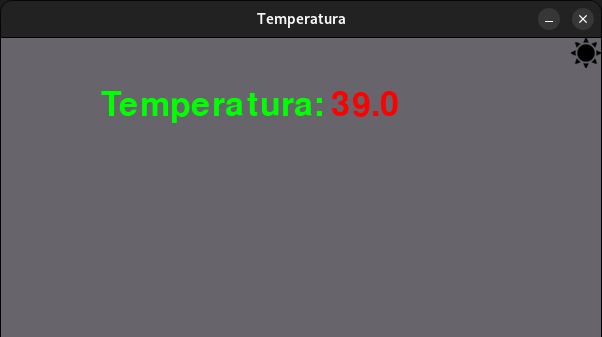

# PyThermo
PyThermo é um analisador de temperatura para Linux desenvolvido em Python usando o Pygame.



## Descrição
Este projeto foi criado como uma ferramenta simples para monitorar e analisar a temperatura do sistema operacional Linux. Utilizando a biblioteca Pygame, PyThermo fornece uma interface gráfica interativa para exibir informações de temperatura de forma visual.

## Funcionalidades
- Monitoramento da temperatura do sistema Linux.
- Interface gráfica amigável e interativa.
- Visualização clara dos dados de temperatura.

## Instalação

### Pré-requisitos
- Python 3.x instalado.
- Pygame instalado. Você pode instalar o Pygame usando o pip:

  ```bash
  pip install pygame
  ```

### Como Executar

1. Clone este repositório:
   ```bash
   git clone https://github.com/JoaoSantos2007/PyThermo.git
   ```
2. Navegue até o diretório do projeto:
   ```bash
   cd PyThermo
   ```
3. Execute o programa:
   ```bash
   python main.py
   ```

## Uso
- Ao executar o programa, a interface gráfica será exibida.
- PyThermo atualizará e exibirá as informações de temperatura do sistema.

## Contribuição
Contribuições são bem-vindas! Se você deseja melhorar este projeto, siga as etapas abaixo:

1. Faça um fork do projeto
2. Crie uma branch para a sua modificação: `git checkout -b feature/nova-feature`
3. Faça o commit das suas alterações: `git commit -am 'Adicionando nova feature'`
4. Envie as alterações para a sua branch: `git push origin feature/nova-feature`
5. Abra um Pull Request

## Autor
João Pedro Tomaz dos Santos - [JoaoSantos2007](https://github.com/JoaoSantos2007)

## Licença
Este projeto está licenciado sob a [Licença MIT](LICENSE).
